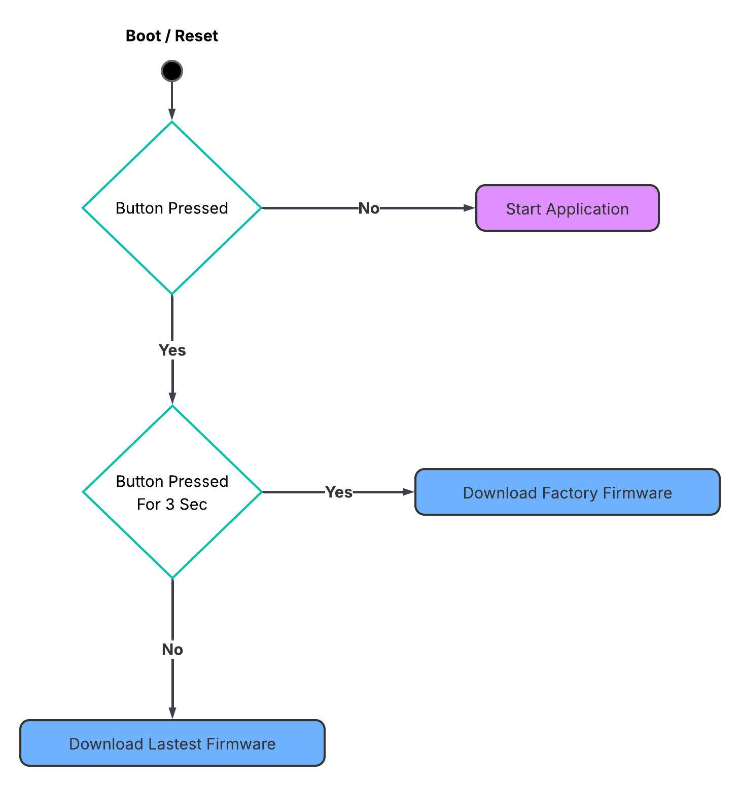
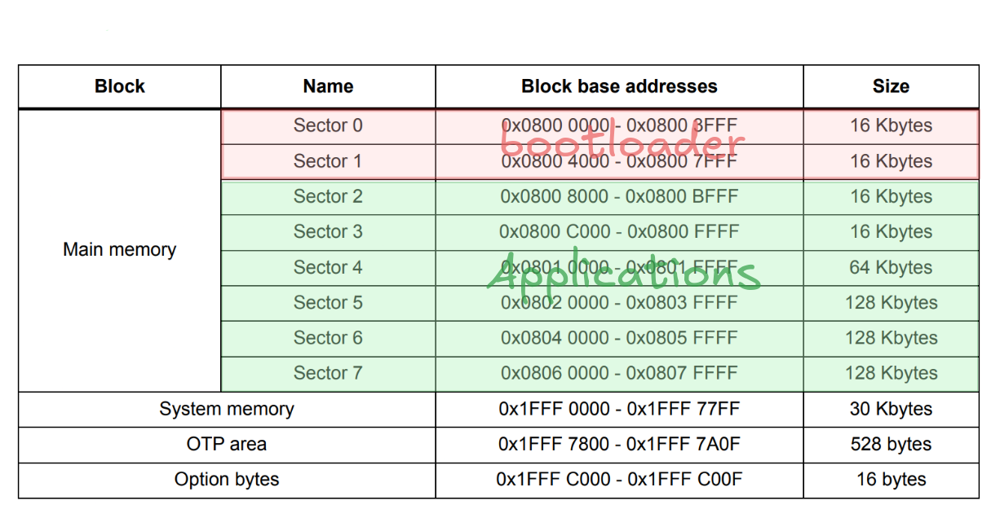

# STM32 Over The Air Update System

An educational Over The Air Update System example. This example is a stm32 bootloader with OTA update that uses a esp32 connect via uart.

### How it Works



Sectors:




`STM******_FLASH.ld`:
```
/* Memories definition */
MEMORY
{
  RAM        (rwx)   : ORIGIN = 0x20000000,  LENGTH = 96K
  FLASH      (rx)    : ORIGIN = 0x08000000,  LENGTH = 32K       // Bootloader
  APPFLASH   (rwx)   : ORIGIN = 0x08008000,  LENGTH = 480K - 8  // Application / Firmware
  FIRMWAREID (rwx)   : ORIGIN = 0x0807FFF8,  LENGTH = 8         // Firmware ID
}


/* Sections */
SECTIONS
{
  

  .application :
  {
    KEEP(*(.application))
  } >APPFLASH

}
```

Your Firmware memories definition should be samething like this:

`STM******_FLASH.ld`:
```
MEMORY
{
  RAM      (xrw)  : ORIGIN = 0x20000000,   LENGTH = 96K
  FLASH    (rx)   : ORIGIN = 0x8008000,    LENGTH = 480K - 8
}
```

### setup

Inside `/bootloader/Core/Src/main.c` line 77 - 81:

```
const FIRMWARE_INFO _deviceInfo_Factory = {
    .firmwareVersionId = 1,
    .deviceModelId = 1,
    .deviceUniqueId = 1,
};
```

these struct contains information about the current device, `firmwareVersionId` this is used us the factory recovery firmware,
`deviceModelId` this field is used to identify the correct firmware for this device, `deviceUniqueId` an ID the deice.

### Server Firmware Repository Layout

```
updaterServer/
└─ deviceModels/
  ├─ MODEL_A/                # Folder name == deviceModelId (integer)
  │  ├─ 1/                   # Folder name == firmwareVersionId (integer)
  │  │  └─ application.bin   # Firmware image (exact filename expected by server)
  │  ├─ 2/
  │  │  └─ application.bin
  │  └─ 3/
  │     └─ application.bin
  └─ MODEL_B/
    ├─ 1/
    │  └─ application.bin
    └─ 4/
      └─ application.bin
```

Rules:
- deviceModels: root catalog of all supported models.
- Each first-level subfolder: one device model; its name must match the deviceModelId the bootloader.
- Inside each model folder: one folder per firmwareVersionId.
- Inside each version folder: application.bin (raw binary produced by the application build).


Adding a new firmware:
1. Build application with updated version constant.
2. Copy resulting binary to: deviceModels/\<deviceModelId\>/\<newVersion\>/application.bin

### Usage

Read the `readme` files inside `updaterDevice` and `updateServer`.

## License

This project is licensed under the MIT License.
