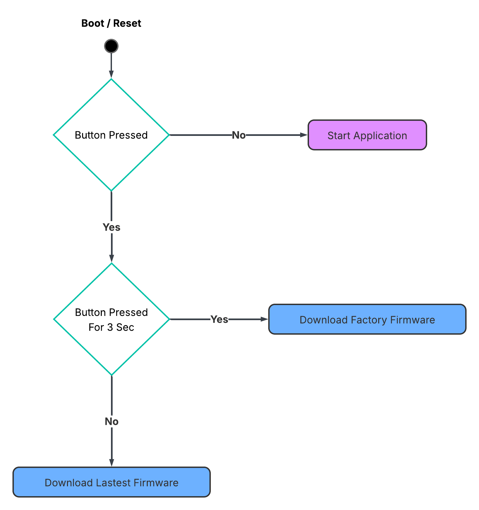
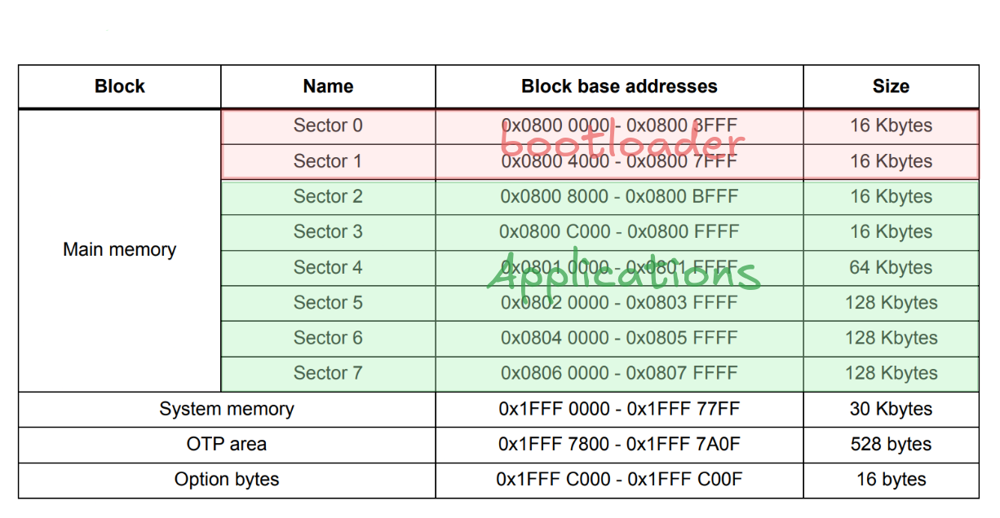

# STM32 Over The Air (OTA) Update System

An educational Over-The-Air (OTA) update system demonstrating secure firmware updates for STM32 microcontrollers. This project implements a custom bootloader on STM32 that communicates with an ESP32 WiFi module via UART to download and install firmware updates from a Python-based HTTPS server.

## Features

- **Custom STM32 Bootloader**: Dual-bank flash management with application execution and update capabilities
- **OTA Updates**: Wireless firmware updates via HTTPS
- **Factory Recovery**: Built-in factory firmware recovery mechanism
- **Version Management**: Automatic version checking and selective updates
- **Secure Communication**: HTTPS with CRC integrity verification
- **ESP32 WiFi Bridge**: Uses ESP32 as a WiFi-to-UART bridge for OTA functionality
- **Multi-Device Support**: Server supports multiple device models with separate firmware versions

## Prerequisites

### Hardware Requirements
- **STM32 Development Board** (tested on STM32F4 series with 512KB flash)
- **ESP32 Development Board** (any ESP32 variant with WiFi)
- USB cables for programming both boards
- UART connection between STM32 and ESP32 (3 wires: TX, RX, GND)

### Software Requirements
- **For STM32 Bootloader & Application:**
  - STM32CubeIDE or compatible ARM GCC toolchain
  - STM32CubeMX (for configuration)
- **For ESP32 Device:**
  - Docker (recommended) or ESP-IDF v4.x+
- **For Update Server:**
  - Python 3.8 or higher
  - pip package manager

## Architecture

### System Overview



The system consists of three main components:

1. **STM32 Bootloader**: Custom bootloader that manages application firmware and OTA updates
2. **ESP32 WiFi Bridge**: Handles HTTPS communication with the update server via UART commands
3. **Update Server**: FastAPI-based server that hosts firmware binaries and serves update requests

### Update Flow

1. **Boot Process**:
   - STM32 bootloader checks for button press during power-on
   - If button pressed for 3 seconds: Factory firmware recovery
   - If button not pressed: Boot into application firmware
   - If no valid application: Attempt to download latest firmware

2. **Firmware Update**:
   - Application or bootloader requests latest version from server via ESP32
   - If newer version available, bootloader downloads it in chunks (1020 bytes each)
   - Each chunk is verified with CRC before writing to flash
   - After complete download, firmware info is saved and device restarts

3. **Version Management**:
   - Each firmware has a unique version ID
   - Server maintains separate firmware repositories per device model
   - Bootloader stores current firmware version in dedicated flash region

### Memory Layout



**Bootloader Flash Memory Configuration** (`STM32******_FLASH.ld`):
```ld
/* Memories definition */
MEMORY
{
  RAM        (rwx)   : ORIGIN = 0x20000000,  LENGTH = 96K
  FLASH      (rx)    : ORIGIN = 0x08000000,  LENGTH = 32K       // Bootloader
  APPFLASH   (rwx)   : ORIGIN = 0x08008000,  LENGTH = 480K - 8  // Application / Firmware
  FIRMWAREID (rwx)   : ORIGIN = 0x0807FFF8,  LENGTH = 8         // Firmware ID
}

/* Sections */
SECTIONS
{
  .application :
  {
    KEEP(*(.application))
  } >APPFLASH
}
```

**Application Firmware Memory Configuration** (`STM32******_FLASH.ld`):
```ld
MEMORY
{
  RAM      (xrw)  : ORIGIN = 0x20000000,   LENGTH = 96K
  FLASH    (rx)   : ORIGIN = 0x08008000,    LENGTH = 480K - 8
}
```

**Key Memory Regions:**
- **Sectors 0-1** (0x08000000 - 0x08007FFF): Bootloader code (32KB)
- **Sectors 2-7** (0x08008000 - 0x0807FFF7): Application firmware (480KB - 8 bytes)
- **Last 8 bytes** (0x0807FFF8 - 0x0807FFFF): Firmware version info with CRC

## Hardware Setup

### STM32 to ESP32 UART Connection

Connect the following pins between STM32 and ESP32:

| STM32 Pin | ESP32 Pin | Description |
|-----------|-----------|-------------|
| PA11 (TX) | GPIO16 (RX) | STM32 TX → ESP32 RX |
| PA12 (RX) | GPIO17 (TX) | STM32 RX ← ESP32 TX |
| GND | GND | Common ground |

**Notes:**
- Ensure both devices share a common ground
- Verify voltage levels are compatible (3.3V for both)
- Default UART settings: 115200 baud, 8N1

## Setup Instructions

### 1. Bootloader Configuration

Edit `/bootloader/Core/Src/main.c` (around line 77-81) to configure device identity:

```c
const FIRMWARE_INFO _deviceInfo_Factory = {
    .firmwareVersionId = 1,      // Factory firmware version ID
    .deviceModelId = 1,           // Device model identifier
    .deviceUniqueId = 1,          // Unique device ID
};
```

**Field Descriptions:**
- `firmwareVersionId`: Version of the factory recovery firmware. Set to your base firmware version.
- `deviceModelId`: Identifies the device model. Server uses this to match correct firmware files. Must match folder name in server's `deviceModels/` directory.
- `deviceUniqueId`: Unique identifier for this specific device instance.

**Build and Flash Bootloader:**
1. Open bootloader project in STM32CubeIDE
2. Build the project (Project → Build All)
3. Flash to STM32 (Run → Debug or use ST-Link Utility)

### 2. Application Firmware Setup

1. **Create Application Project:**
   - Create new STM32 project or use existing application
   - Configure linker script to use correct memory region (starting at 0x08008000)

2. **Set Version in Application Code:**
   - Define firmware version constant in your application:
   ```c
   const uint32_t FIRMWARE_VERSION = 1;  // Increment for each release
   ```

3. **Build and Generate Binary:**
   - Build your application project
   - Locate the `.bin` file in build output (e.g., `Debug/YourApp.bin`)

4. **Initial Flash:**
   - For first-time setup, you can flash the application directly using ST-Link
   - Or place it in the server directory and use bootloader recovery mode

### 3. Update Server Setup

Navigate to the `updaterServer` directory:

```bash
cd updaterServer
```

#### Create Python Virtual Environment

```bash
# Create virtual environment
python3 -m venv venv

# Activate virtual environment
# On Linux/macOS:
source venv/bin/activate
# On Windows:
venv\Scripts\activate

# Install dependencies
pip install -r requirements.txt
```

#### Generate SSL Certificates

The server requires HTTPS with SSL certificates. You can either use the provided script or follow manual steps:

**Option A: Using the provided script**
```bash
./cert_config.sh
```

**Option B: Manual certificate generation**

1. Create certificate directory:
```bash
mkdir -p cert && cd cert
```

2. Generate CA private key and certificate:
```bash
# Generate CA private key (2048-bit RSA)
openssl genrsa -out server_root_key.pem 2048

# Create self-signed CA certificate
openssl req -x509 -new -nodes -key server_root_key.pem -sha256 -days 3650 \
  -out server_root_cert.pem -subj "/CN=MyCA"
```

3. Create server certificate configuration file `server_csr.cnf`:
```ini
[ req ]
default_bits       = 2048
prompt             = no
default_md         = sha256
distinguished_name = dn
req_extensions     = req_ext

[ dn ]
CN = controlserver.local

[ req_ext ]
subjectAltName = @alt_names

[ alt_names ]
IP.1 = 192.168.1.100    # Change to your server's IP
DNS.1 = localhost
DNS.2 = controlserver.local
```

4. Generate server key and certificate:
```bash
# Generate server private key
openssl genrsa -out server.key 2048

# Generate certificate signing request (CSR)
openssl req -new -key server.key -out server.csr -config server_csr.cnf

# Sign the server certificate with CA
openssl x509 -req -in server.csr -CA server_root_cert.pem \
  -CAkey server_root_key.pem -CAcreateserial -out server.crt \
  -days 365 -sha256 -extensions req_ext -extfile server_csr.cnf
```

5. (Optional) Add CA certificate to system trust store on Linux:
```bash
sudo cp server_root_cert.pem /usr/local/share/ca-certificates/myca.crt
sudo update-ca-certificates
```

#### Setup Firmware Repository

Create the directory structure for hosting firmware files:

```bash
cd updaterServer
mkdir -p deviceModels
```

**Directory Structure:**

```
updaterServer/
└── deviceModels/
    ├── 1/                     # Folder name = deviceModelId (must match bootloader config)
    │   ├── 1/                 # Folder name = firmwareVersionId
    │   │   └── application.bin
    │   ├── 2/
    │   │   └── application.bin
    │   └── 3/
    │       └── application.bin
    └── 2/                     # Another device model
        ├── 1/
        │   └── application.bin
        └── 2/
            └── application.bin
```

**Rules:**
- `deviceModels/`: Root directory for all firmware files
- First-level folders: Device model ID (must match `deviceModelId` in bootloader)
- Second-level folders: Firmware version ID (incremental integers)
- Binary file: Must be named exactly `application.bin`

**Adding New Firmware:**

1. Build your application with updated version number
2. Locate the `.bin` file in your build output
3. Create/navigate to: `deviceModels/<deviceModelId>/<newVersionId>/`
4. Copy binary: `cp YourApp.bin deviceModels/1/2/application.bin`

Example:
```bash
# For device model 1, version 2
mkdir -p deviceModels/1/2
cp ~/STM32Project/Debug/MyApp.bin deviceModels/1/2/application.bin
```

#### Start the Update Server

**Option 1: Using Python directly (requires root for port 443):**
```bash
sudo -E ./venv/bin/python server.py
```

**Option 2: Using uvicorn with non-privileged port (recommended for development):**
```bash
uvicorn server:app --host 0.0.0.0 --port 8443 \
  --ssl-keyfile=cert/server.key --ssl-certfile=cert/server.crt --reload
```

**Option 3: Using uvicorn with port 443 (production):**
```bash
sudo -E ./venv/bin/uvicorn server:app --host 0.0.0.0 --port 443 \
  --ssl-keyfile=cert/server.key --ssl-certfile=cert/server.crt --reload
```

The server will start and listen for HTTPS connections. API documentation will be available at `https://<server-ip>:443/docs` (or port 8443).

### 4. ESP32 Device Setup

The ESP32 acts as a WiFi-to-UART bridge, forwarding commands from STM32 to the update server.

Navigate to the `updaterDevice` directory:

```bash
cd updaterDevice
```

#### Configure WiFi and Server Settings

Edit `updaterDevice/main/configuration.h` to set your WiFi credentials and server details:

```c
#define WIFI_SSID "YourWiFiSSID"
#define WIFI_PASSWORD "YourWiFiPassword"
#define UPDATE_SERVER_URL "https://192.168.1.100"  // Your server IP
#define UPDATE_SERVER_PORT 443
```

Copy the CA certificate (`server_root_cert.pem`) generated in the server setup to the ESP32 project. This certificate allows the ESP32 to verify the server's identity.

#### Build and Flash ESP32

**Option A: Using Docker (Recommended)**

1. Ensure ESP32 is connected via USB
2. Check the port:
   ```bash
   ls /dev/ttyUSB*
   ```
3. If not `/dev/ttyUSB0`, edit `docker-compose.yml` and update the device mapping:
   ```yaml
   devices:
     - /dev/ttyUSB1:/dev/ttyUSB0  # Adjust as needed
   ```
4. Start Docker environment and build:
   ```bash
   ./start_docker.sh
   ```
5. Inside the container (you'll be attached automatically):
   ```bash
   idf.py app-flash monitor
   ```

**Option B: Using ESP-IDF directly**

If you have ESP-IDF installed locally:
```bash
idf.py build
idf.py -p /dev/ttyUSB0 flash monitor
```

**Monitor Output:**
- The ESP32 will connect to WiFi and wait for commands from STM32
- Press `Ctrl+]` to exit monitor

## Usage

### Initial Firmware Installation

**Method 1: Direct Flash (First Time Setup)**
1. Flash bootloader to STM32
2. Flash application firmware to STM32 starting at address 0x08008000
3. Power cycle the device

**Method 2: OTA Recovery (Factory Firmware)**
1. Flash bootloader to STM32
2. Place factory firmware in server: `deviceModels/1/1/application.bin`
3. Power on STM32 while holding the user button for 3 seconds
4. Bootloader will download and install factory firmware

### Performing OTA Updates

1. **Prepare New Firmware:**
   - Increment version number in your application code
   - Build the application
   - Copy `.bin` file to server: `deviceModels/<modelId>/<newVersion>/application.bin`

2. **Trigger Update:**
   - **Automatic**: Bootloader checks for updates on every boot
   - **Manual**: Implement update check in your application and trigger bootloader via software reset

3. **Update Process:**
   - Bootloader queries server for latest version
   - If newer version available, downloads firmware in chunks
   - Verifies each chunk with CRC
   - Writes to flash and updates version info
   - Restarts device with new firmware

### Button Functions

- **Short Press**: Normal boot into application
- **Hold 3 Seconds**: Factory firmware recovery (downloads version 1)

## API Endpoints

The update server exposes the following REST API endpoints:

### `GET /`
Welcome message and server status.

**Response:**
```json
{
  "message": "Welcome to update server!"
}
```

### `GET /device/{deviceModelID}/latest`
Get the latest available firmware version for a device model.

**Parameters:**
- `deviceModelID` (int): Device model identifier

**Response:**
- Binary data: 4-byte version ID + 4-byte CRC
- Status 400: Invalid device ID (model not found)

**Example:**
```bash
curl -k https://192.168.1.100/device/1/latest --output version.bin
```

### `GET /update/{deviceModelID}/{versionID}/{cursorKb}`
Download a chunk of firmware binary.

**Parameters:**
- `deviceModelID` (int): Device model identifier
- `versionID` (int): Firmware version to download
- `cursorKb` (int): Chunk index (each chunk is 1020 bytes)

**Response:**
- Binary data: 4-byte CRC + 4-byte header + 1020-byte chunk
- Header: `0xFFFFFFFF` for more chunks, `0x00000000` for last chunk
- Status 404: Firmware file not found

**Example:**
```bash
# Download first chunk (cursor 0)
curl -k https://192.168.1.100/update/1/2/0 --output chunk_0.bin
```

